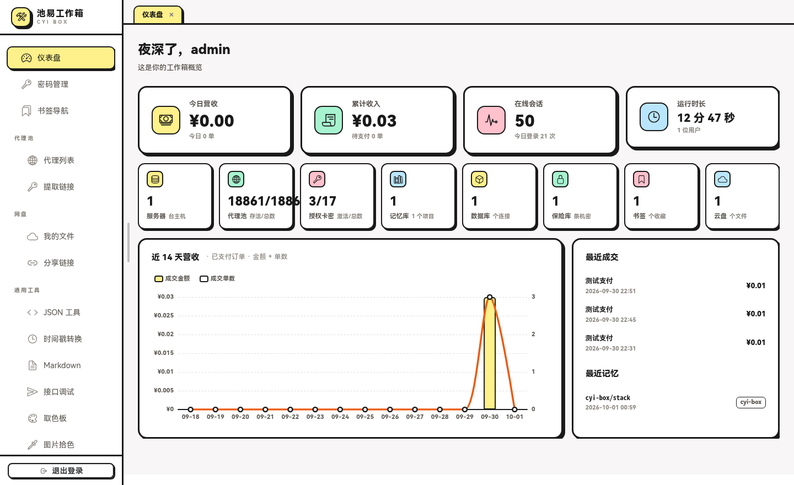
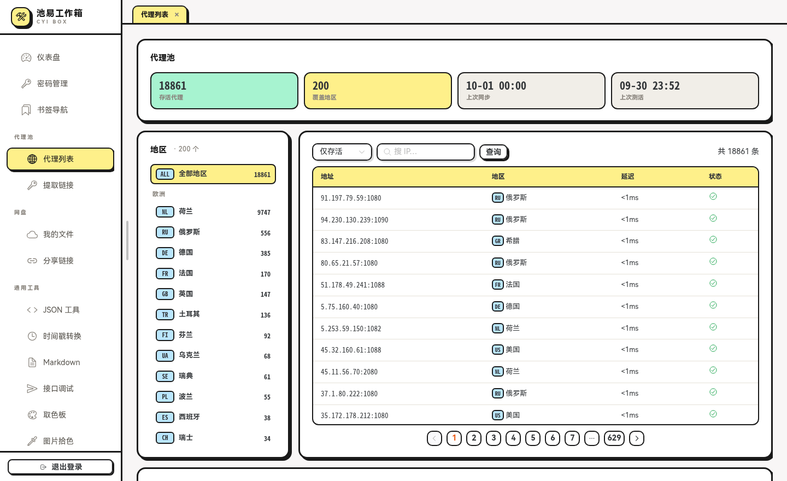
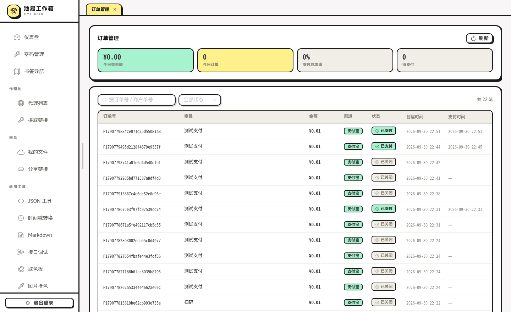
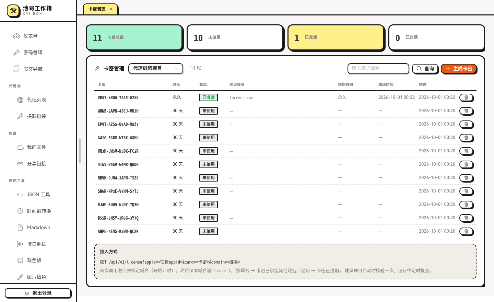
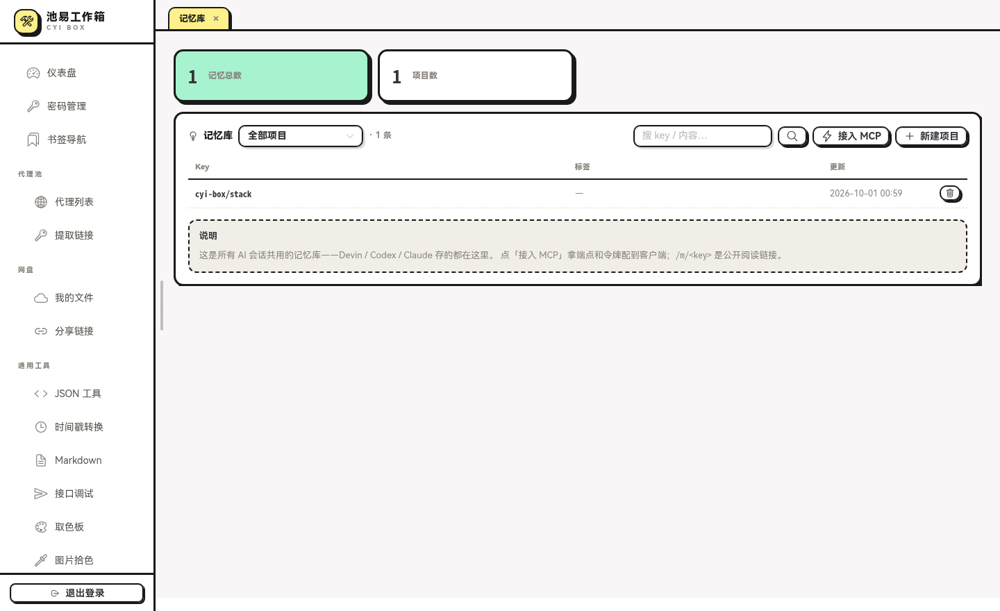
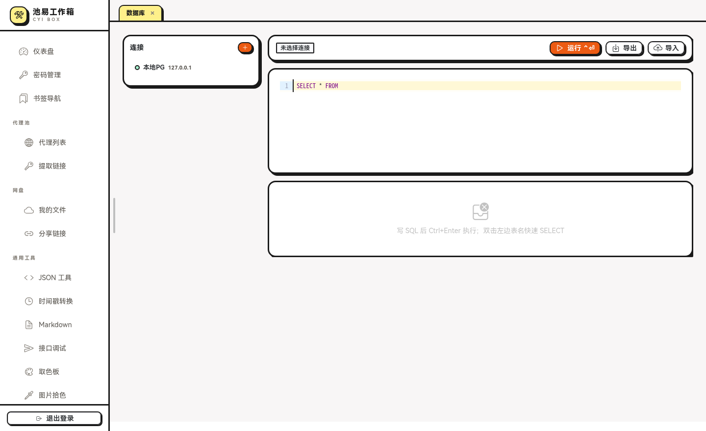

# 池易工作箱 · cyi-box

孟菲斯/新粗野主义风格的个人工作箱 + 管理后台。单二进制 + SQLite 就能跑：支付网关、授权卡密系统、内置 MCP Server 的 AI 共享记忆库、服务器监控、代理池、数据库管理器、网盘、密码箱、书签导航和一套开发者小工具。

后端 Go + [fun](https://github.com/cyi-cc/fun) 单端点 RPC + sqlc/SQLite，前端 Vue 3 + Vite + Naive UI + ECharts + CodeMirror。


## 截图

| 仪表盘 | 代理池 |
|---|---|
|  |  |
| **订单管理** | **授权卡密** |
|  |  |
| **记忆库** | **数据库管理** |
|  |  |

## 功能一览

- **仪表盘**：营收/订单/会话 KPI、模块宫格快捷入口、近 14 天营收趋势（金额+单数双轴）、最近成交与记忆动态
- **支付网关**：Epay 兼容协议（`submit.php` / `mapi.php` / `api.php`）、商户 PID/Key、商品+CDK 库存（锁定分配、裸 hex 卡密）、二维码收银台、订单状态实时推送（`fun.Stream`）、异步通知重试
- **授权系统**：项目管理（每个项目独立 `appid`）+ 卡密批量生成；`GET /v1/license` 公开校验——首次激活绑域名、异域名拒绝、0 小时=永久、项目停用全卡失效
- **记忆库 / MCP Server**：`POST /mcp` Streamable HTTP MCP 端点（Bearer 鉴权），`memory_save/get/search/list/delete/projects` 六个工具 + `memory://<key>` resources + `save_context` prompt；FTS5 trigram 全文搜索（中文子串可命中）；`GET /m/<key>?sig=` HMAC 签名阅读链接；Devin/Codex/Claude 共用一座库
- **服务器管理**：SSH 密码/密钥登录（AES-GCM 加密存储）、CPU/内存/磁盘/网速实时监控、WebSocket 终端（xterm.js）、SFTP 文件管理
- **代理池**：双数据源每日同步、协议级握手测活（SOCKS4/5、HTTP，裸 TCP 不算数）、大洲→地区分组、提取密钥 `pk_xxx` + `GET /v1/proxy` 随机活代理 API
- **数据库管理器**：MySQL / PostgreSQL / SQLite 连接（密码加密存储）、库表列结构 → CodeMirror SQL 补全、Ctrl+Enter 执行、JSON/CSV/XLSX 导入导出
- **网盘**：拖拽上传、限时/永久分享链接（`GET /d/<code>` 免登录）、下载计数
- **密码箱**：AES-GCM 加密存储、TOTP/otpauth 解析与验证码
- **开发者工具**：JSON 格式化、时间戳转换、Markdown 编辑器、接口调试（服务端代发绕 CORS）、取色板、图片拾色、渐变图鉴

## 快速开始

环境：Go 1.24+（含 `go tool sqlc`）、Node 20+。

```bash
make dev      # 后端 :8890 + 前端 :5173（vite 把 /api 代理到后端）
```

浏览器开 `http://127.0.0.1:5173`，默认账号 `admin / admin123`（首次启动自动建库建号，用 `CYIBOX_ADMIN_PASSWORD` 覆盖）。

生产部署：

```bash
make build    # go build + vite build → backend/cyibox + frontend/dist
```

`cyibox` 单二进制即可跑（数据库首启自动创建于 `./data/cyibox.db`）；前端 dist 用任意静态服务/反代托管，把 `/api`、`/mcp`、`/m`、`/v1`、`/d` 等前缀转发到后端即可。

## Docker Compose（推荐部署方式）

```bash
docker compose up -d --build
```

打开 `http://<宿主机>:8890`（compose 里 `8890:80`，左侧端口随意改）。单容器内含：nginx（托管前端 + 反代）+ 后端二进制，`/app/data` 卷承载 SQLite、vault.key 与网盘文件。

```bash
CYIBOX_ADMIN_PASSWORD=<强密码> docker compose up -d --build   # 自定义初始管理员密码
docker compose logs -f                                       # 看日志
```

## 环境变量

| 变量 | 默认 | 说明 |
|---|---|---|
| `CYIBOX_PORT` | `8890` | 后端监听端口 |
| `CYIBOX_DB` | `./data/cyibox.db` | SQLite 路径（自动创建） |
| `CYIBOX_ADMIN_NAME` | `admin` | 初始管理员名 |
| `CYIBOX_ADMIN_PASSWORD` | `admin123` | 初始管理员密码（**上线前必改**） |
| `CYIBOX_CORS` | 空 | 跨域白名单（逗号分隔） |
| `CYIBOX_VAULT_KEY` | `<db目录>/vault.key` | AES-GCM 密钥文件（自动生成） |
| `CYIBOX_DISK_DIR` | `<db目录>/files` | 网盘文件目录 |

## MCP 接入（AI 记忆库）

「记忆库 → 接入 MCP」页面拿端点和令牌，配置到客户端：

```json
{
  "mcpServers": {
    "memory": {
      "url": "http://<你的域名或IP>:8890/mcp",
      "transport": "http",
      "headers": { "Authorization": "Bearer <令牌>" }
    }
  }
}
```

工具：`memory_save`（key 必填，`project/topic` 命名）· `memory_get` · `memory_search`（FTS5）· `memory_list` · `memory_projects` · `memory_delete`；资源 `memory://<key>`；prompt `save_context`。

## 开发

```bash
make gen            # sqlc 重新生成 internal/db + TS 客户端（改了 service/DTO/SQL 后跑）
make build          # go build + vite build
```

## 结构

```
backend/                  Go 后端（module github.com/cyi-cc/cyi-box/backend）
  sqlc.yaml               sqlc 配置（engine sqlite）
  cmd/server/             服务入口
  cmd/gen/                TS 客户端生成（BindServiceForGen，不碰数据库）
  internal/config/        环境变量配置
  internal/db/            schema.sql + queries.sql + sqlc 生成物（勿手改 *.sql.go / models.go）
  internal/store/         数据门面层：委托 db.Queries + 会话续期/种子等定制逻辑
  internal/sshx/          SSH 拨号 + 指标采集（/proc 两采样）
  internal/vault/         AES-GCM 字段加密 + TOTP/otpauth 解析
  internal/dto/           RPC DTO（定宽整型/指针可空，见 fun 文档）
  internal/service/       AuthGuard 策略表 + 各 Svc + SFTP/终端自定义路由
frontend/                 Vue 3 + Vite + Naive UI + Pinia + vue-router
  src/api/                fun GenTs 生成产物（勿手改，跑 make gen 重新生成）
  src/lib/api.ts          client 封装：token 注入 state、4011 统一跳登录
  src/layouts/            后台布局（左侧导航：通用工具静态组 + 书签组）
  src/views/              登录/仪表盘/用户/密码箱/书签/服务器，tools/ 下为内置工具页
```

## 启动

```bash
make dev            # 后端 :8890 + 前端 :5173（vite 代理 /api → /cell）
```

首次启动自动建库并种子 `admin / admin123`（用 `CYIBOX_ADMIN_PASSWORD` 改掉）。
可选环境变量：`CYIBOX_PORT`、`CYIBOX_DB`、`CYIBOX_ADMIN_NAME`、`CYIBOX_CORS`。

## 常用

```bash
make gen            # sqlc 重新生成 internal/db + 重新生成 TS 客户端
make build          # go build + vite build
```

## 数据层约定

- 表结构与查询写在 `internal/db/schema.sql` / `queries.sql`，`go tool sqlc generate` 生成类型安全代码；
- `internal/store` 是门面层：服务层统一调它，sqlc 表达不了的（会话滑动续期、映射）在这里实现；
- 注意：sqlc 的 sqlite 解析器对 `.sql` 注释里的 `/`、`:` 有兼容问题，注释只写 `-- name:` 行；
- 建表语句以 `schema.sql` 为准，运行时经 `db.SchemaDDL` 自动迁移。

## 服务器管理

- 密钥/私钥 AES-GCM 加密存 `servers.secret_enc`（复用 vault.key，可用 `CYIBOX_VAULT_KEY` 指定）；
- 指标：SSH 跑一段 shell 两采样 `/proc/stat` + `/proc/net/dev` + `df`，得 CPU%/内存/磁盘/网速率；
- SFTP：RPC 列目录/建目录/删/改名，上传 `POST /api/files/upload`、下载 `GET /api/files/download`；
- 终端：`GET /api/ws/terminal` 升级 WebSocket → SSH PTY（xterm.js），query `token` 鉴权（仅 admin）。

## 通用工具

侧边栏「通用工具」组内置 6 个小工具：

- `/tools/json` JSON 格式化/压缩/校验，左右分栏 + 语法高亮
- `/tools/timestamp` 时间戳转换：实时钟、单位自动识别（s/ms/µs/ns）、多时区、相对时间、批量转换
- `/tools/markdown` Markdown 编辑 + 实时预览（markdown-it，html 关闭防 XSS）
- `/tools/postman` 接口调试：`WebSvc.Fetch` 服务端代发绕开 CORS，30s 超时/5 次重定向/响应 2MB 截断，历史存 localStorage
- `/tools/color` 取色板：HSL 色球（角度=色相/半径=饱和/明度滑杆）、图片上传拾色 + 主色提取、明度阶梯、配色方案
- `/tools/gradient` 渐变图鉴：预设 + 随机 + 自定义，一键复制 CSS

## 网盘

- 文件落盘 `<db目录>/files/`（`CYIBOX_DISK_DIR` 可改），`files` 表记录原始名/大小/mime；
- 上传 `POST /disk/upload`（multipart，登录用户）、属主下载 `GET /disk/download?id=&token=`；
- 分享：`shares` 表存 code + 到期时间（0=永久），公开下载 `GET /d/<code>` 免登录，
  过期返回 410 页面，命中计 downloads；删文件连带删分享与磁盘文件；
- 前端 `/disk`：拖拽/点选上传、文件行内分享弹窗（永久/10分~7天/自定义分钟）、链接列表显示剩余时间。

## 数据库管理器

- 支持 mysql / postgres / sqlite 连接，密码 AES-GCM 存 `dbconns.password_enc`；
- 库/表/列 introspection 喂给 CodeMirror sql 补全；Ctrl+Enter 执行（选中片段优先）；
- 查询 20s 超时、行数封顶（默认 500，上限 10000）；按首关键字判定是否结果集语句；
- 导出 `POST /api/dbm/export`：json/csv/xlsx（结果集最大 5 万行）；
- 导入 `POST /api/dbm/import`：json 对象数组 / csv / xlsx，首行表头与表列按名交集，逐行插入、坏行跳过计数，上限 1 万行。

## 代理池

- 数据源两个，任一失败不致命（失败源名下的代理本轮不删）：
  - `GET https://proxy5.net/api/free-proxies.php?v=<30min窗口>`（页面 JS 的接口，直连会被
    Cloudflare 拦：`proxyx.Fetch` 带浏览器 UA/Referer/gzip，403 时先拉列表页热 cookie 再重试）；
  - `GET https://rola-ip.co/proxy-api/api/v1/proxies?page=N&pageSize=500`（`proxyx.FetchRola`，
    页面前端走的公开前缀，免登录，500/页翻到底，大洲由内置国家码映射补）；
- 多源按 ip:port 合并（协议并集），`proxies.source` 记录归属源；删除规则=没出现在任何成功源里才删；
- `proxy_regions`（code 如 SG/NL + 中文名 + 大洲）与 `proxies`（region_id 外键，ip:port 唯一）；
- 同步：启动时若无数据或上次超过 20h 补一次，之后每日 00:00（本地时区）全量 diff——
  源上消失即删、已存在刷新指标复活、新增入库；`proxy_syncs` 记录 added/removed/updated 与明细
  （各最多 200 个地址）；
- 测活：每小时一轮，对距上次检测 >55min 的**全部**代理做**协议级握手**（SOCKS5 greeting+CONNECT /
  SOCKS4 / HTTP GET 转发——裸 TCP 连通不算数，防透明网关误判），并发 128、4s 超时；
  失败标 alive=0，拨活即复活（alive=1、fail_count 清零），死记录 7 天后物理清除；
- 页面 `/proxies`：左栏大洲→地区分类（存活数），右侧筛选/搜索/分页列表，底部同步记录可展开变更明细；
- `ProxySvc`：List/Regions/Stats 登录即可，Syncs/SyncNow/CheckNow 仅 admin。

## 代理提取 API

- `/proxies/extract` 页生成密钥（`pk_xxx`，存 `proxy_keys` 表，绑定地区或「全部」），删除即吊销；
- `GET /v1/proxy?key=<密钥>` 免登录：随机抽 15 个存活候选**并行**协议级探活（3s 超时），
  先活先回一行 `ip:port` 纯文本（加 `&fmt=url` 返回 `scheme://ip:port`，scheme 为握手实测的
  socks5h/http/socks4）；死的顺手标 `alive=0`，最多 4 批 / 20s 总超时，全死 503；
- 每次成功提取 `used_count+1`、`last_used_at` 更新。

## 系统设置

- `/settings`（admin）：修改密码。`SettingSvc`（Get 登录可读 / Set 仅 admin，`settings` KV 表）
  已就位，暂无前端消费方，后续站点级开关可挂在这。

## 加一个新工具页

1. `frontend/src/views/tools/` 下写页面，路由加在 `router/index.ts` 的 children 里；
2. 侧边栏 `AdminLayout.vue` 的「通用工具」组里加一项；
3. 需要后端时：`service/` 里建 Svc（嵌 `fun.Ctx`，方法 `DTO → (View, error)`），
   在 `auth_guard.go` 的策略表登记端点，`cmd/server` 与 `cmd/gen` 各加一行注册，
   然后 `make gen`。注意：svc 结构体字段必须全部导出（fun autowired 反射赋值，未导出字段会 panic），
   包级单例放普通变量即可。

## 鉴权约定

- 前端 token 存 localStorage，请求拦截器写 `state.token`；
- `AuthGuard` 按「服务.方法」策略表鉴权（缺省拒绝），会话存 SQLite，24h 滑动过期（闲置 2h 后的下次请求自动续回 24h）；
- 业务错误 `fun.Error(code, msg)`；`4011` = 登录失效，前端统一跳登录页；
- SFTP/终端等自定义路由不走 AuthGuard，`routeAdmin` 手动校验 query token。
